#  Tutorial: Introdução ao Bootstrap - Botões

Este tutorial fornece uma visão geral do uso de botões no Bootstrap, um framework popular de design front-end. Abaixo estão exemplos de diferentes estilos de botões usando classes pré-definidas no Bootstrap.

## Tabela de conteúdo
|Tópico|
|------|
|[Configuração Básica do HTML para Bootstrap](#configuração-básica-do-html-para-bootstrap)|
|[Botões no Bootstrap](#botões-no-bootstrap)|
|[Classe Padrão](#1-classe-padrão)|
|[Classes Padrão com Outline Warning/Danger/Dark/Light](#2-classes-padrão-com-outline-warningdangerdarklight)|
|[Classes Padrão Warning/Danger/Dark/Light](#3-classes-padrão-warningdangerdarklight)|
|[Classes Padrão Warning/Danger/Dark/Light com Outline Primary](#4-classes-padrão-warningdangerdarklight-com-outline-primary)|
|[Classes Outline Warning/Danger/Dark/Light](#5-classes-outline-warningdangerdarklight)|
|[Classes Outline Primary/Secondary/Success/Info](#6-classes-outline-primarysecondarysuccessinfo)|
|[Classes de Tamanhos](#7-classes-de-tamanhos)|
|[Grupos de Botões](#8-grupos-de-botões)|
|[Grupos de Botões Verticais](#9-grupos-de-botões-verticais)|

1. Vamos usar a base html para o Bootstrap

    Base HTML:
    ``` html
        <!DOCTYPE html>
    <html lang="pt-br">

    <head>
        <meta charset="utf-8">
        <meta name="viewport" content="width=device-width, initial-scale=1">
        <title>Curso de Bootstrap</title>
        <link href="https://cdn.jsdelivr.net/npm/bootstrap@5.3.2/dist/css/bootstrap.min.css" rel="stylesheet"
            integrity="sha384-T3c6CoIi6uLrA9TneNEoa7RxnatzjcDSCmG1MXxSR1GAsXEV/Dwwykc2MPK8M2HN" crossorigin="anonymous">
    </head>

    <body>
        <!-- ... Seu conteúdo HTML aqui ... -->
        
        <script src="https://cdn.jsdelivr.net/npm/bootstrap@5.3.2/dist/js/bootstrap.bundle.min.js"
            integrity="sha384-C6RzsynM9kWDrMNeT87bh95OGNyZPhcTNXj1NW7RuBCsyN/o0jlpcV8Qyq46cDfL"
            crossorigin="anonymous"></script>
    </body>

    </html>
    ```

## Botões no Bootstrap

### 1. Classe Padrão


```html
<button type="button" class="btn">Normal</button>
<button type="button" class="btn btn-primary">Primário</button>
<button type="button" class="btn btn-secondary">Secundário</button>
<button type="button" class="btn btn-success">Sucesso</button>
<button type="button" class="btn btn-info">Informação</button>
<button type="button" class="btn btn-link">Link</button>
```


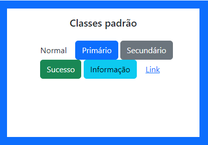

* Normal: Botão simples.
* Primário: Destaque principal.
* Secundário: Opção secundária.
* Sucesso: Indicação de sucesso.
* Informação: Informação adicional.
* Link: Estilo de link sem aparência de botão.
<br>

### 2. Classes Padrão com Outline Warning/Danger/Dark/Light

```html
<button type="button" class="btn">Normal</button>
<button type="button" class="btn btn-primary btn-outline-warning">Primário Outline Warning</button>
<button type="button" class="btn btn-secondary btn-outline-danger">Secundário Outline Danger</button>
<button type="button" class="btn btn-success btn-outline-dark">Sucesso Outline Dark</button>
<button type="button" class="btn btn-info btn-outline-light">Informação Outline Light</button>
```

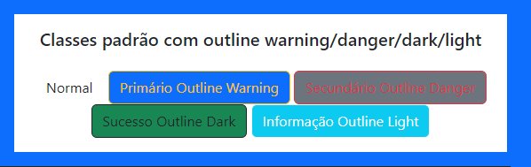
Ao passar o mouse em cima a cor irá mudar

* Outline Warning/Danger/Dark/Light: Adiciona contorno aos botões com as respectivas cores indicando alerta, perigo, escuro e claro.

<br><br>


### 3. Classes Padrão Warning/Danger/Dark/Light

```html
<button type="button" class="btn btn-warning">Alerta</button>
<button type="button" class="btn btn-danger">Perigo</button>
<button type="button" class="btn btn-dark">Dark</button>
<button type="button" class="btn btn-light">Light</button>
<button type="button" class="btn btn-link">Link</button>
```
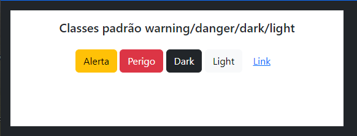

* Warning/Danger/Dark/Light: Botões com cores representando alerta, perigo, escuro e claro.

<br>

### 4. Classes Padrão Warning/Danger/Dark/Light com Outline Primary


```html
<button type="button" class="btn btn-warning btn-outline-primary">Alerta Outline Primary</button>
<button type="button" class="btn btn-danger btn-outline-secondary">Perigo Outline Secondary</button>
<button type="button" class="btn btn-dark btn-outline-success">Dark Outline Sucesso</button>
<button type="button" class="btn btn-light btn-outline-info">Light Outline Informação</button>
```
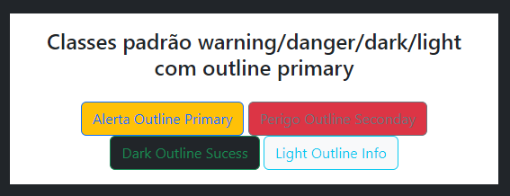

*  Adiciona contorno aos botões com as cores respectivas o botão primário, mantendo a aparência da classe warning danger dark e light.
<br>

### 5. Classes Outline Warning/Danger/Dark/Light


```html
<button type="button" class="btn btn-outline-warning">Outline Alerta</button>
<button type="button" class="btn btn-outline-danger">Outline Perigo</button>
<button type="button" class="btn btn-outline-dark">Outline Dark</button>
<button type="button" class="btn btn-outline-light">Outline Light</button>
```

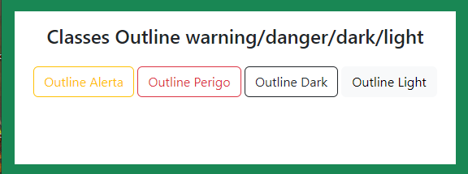

* Outline Warning/Danger/Dark/Light: Botões com contorno nas cores representando alerta, perigo, escuro e claro.
<br>

### 6. Classes Outline Primary/Secondary/Success/Info

```html
<button type="button" class="btn">Normal</button>
<button type="button" class="btn btn-outline-primary">Outline Primário</button>
<button type="button" class="btn btn-outline-secondary"> Outline Secundário</button>
<button type="button" class="btn btn-outline-success">Outline Sucesso</button>
<button type="button" class="btn btn-outline-info">Outline Informação</button>
```
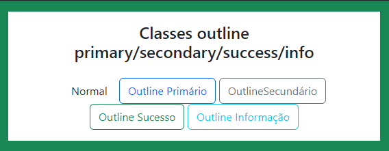
* Outline Primary/Secondary/Success/Info: Botões com contorno nas cores padrão do Bootstrap
<br>

### 7. Classes de Tamanhos
    
```html
<button type="button" class="btn btn-outline-primary btn-sm">Tamanho</button>
<button type="button" class="btn btn-outline-secondary"> Tamanho</button>
<button type="button" class="btn btn-outline-success btn-lg">Tamanho</button>
```
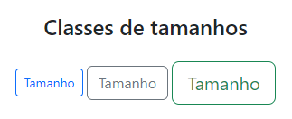

* Tamanho: Botões com tamanhos pequeno (btn-sm), padrão e grande (btn-lg).
<br>

### 8. Grupos de Botões

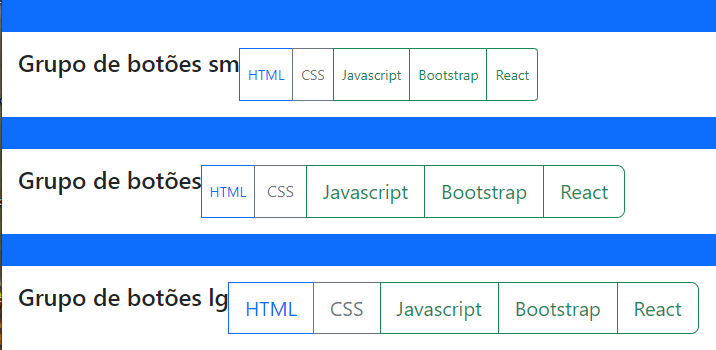

* Grupos de Botões: Agrupamento de botões para facilitar a organização e interação do usuário.
    
    Grupo de Botões SM

    ```html
    <div class=" btn-group btn-group-sm"> <!--Estou indicando que temos um grupo de botões aqui-->
        <h2 class="text-center fs-4 mb-4">Grupo de botões sm </h2>
        <button type="button" class="btn btn-outline-primary ">HTML</button>
        <button type="button" class="btn btn-outline-secondary"> CSS</button>
        <button type="button" class="btn btn-outline-success ">Javascript</button>
        <button type="button" class="btn btn-outline-success ">Bootstrap </button>
        <button type="button" class="btn btn-outline-success ">React </button>
    </div>
    ```

    Grupo de Botões

    ```html
    <div class="btn-group"> <!--Estou indicando que temos um grupo de botões aqui-->
        <h2 class="text-center fs-4 mb-4">Grupo de botões </h2>
        
        <button type="button" class="btn btn-outline-primary btn-sm">HTML</button>
        <button type="button" class="btn btn-outline-secondary"> CSS</button>
        <button type="button" class="btn btn-outline-success btn-lg">Javascript</button>
        <button type="button" class="btn btn-outline-success btn-lg">Bootstrap </button>
        <button type="button" class="btn btn-outline-success btn-lg">React </button>
    </div>
    ```

    Grupo de Botões lg

    ```html
    <div class="btn-group btn-group-lg"> <!--Estou indicando que temos um grupo de botões aqui-->
        <h2 class="text-center fs-4 mb-4">Grupo de botões lg</h2>
        
        <button type="button" class="btn btn-outline-primary btn-sm">HTML</button>
        <button type="button" class="btn btn-outline-secondary"> CSS</button>
        <button type="button" class="btn btn-outline-success btn-lg">Javascript</button>
        <button type="button" class="btn btn-outline-success btn-lg">Bootstrap </button>
        <button type="button" class="btn btn-outline-success btn-lg">React </button>
    </div>
    ```
    
<br>

### 9. Grupos de Botões Verticais

    Grupo de Botões Vertical SM


```html
<div class="btn-group-vertical btn-group-sm">
    <h2 class="text-center fs-4 mb-4">sm</h2>
    <!-- Botões aqui -->
    <button type="button" class="btn btn-dark">small</button>
    <button type="button" class="btn btn-dark">small</button>
    <button type="button" class="btn btn-dark">small</button>
    <button type="button" class="btn btn-dark">small</button>
</div>
```

    Grupo de Botões Vertical

```html
<div class="btn-group-vertical m-5">
    <h2 class="text-center fs-4 mb-4">normal</h2>
    <!-- Botões aqui -->
    <button type="button" class="btn btn-dark">normal</button>
    <button type="button" class="btn btn-dark">normal</button>
    <button type="button" class="btn btn-dark">normal</button>
    <button type="button" class="btn btn-dark">normal</button>
</div>
```

    Grupo de Botões Vertical LG

```html
<div class="btn-group-vertical btn-group-lg">
    <h2 class="text-center fs-4 mb-4">normal</h2>
    <!-- Botões aqui -->
    <button type="button" class="btn btn-dark">normal</button>
    <button type="button" class="btn btn-dark">normal</button>
    <button type="button" class="btn btn-dark">normal</button>
    <button type="button" class="btn btn-dark">normal</button>
</div>
```

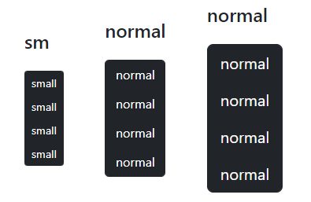
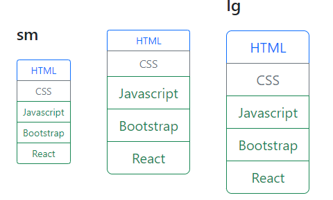

* Grupos de Botões Verticais: Agrupamento vertical de botões para uma apresentação mais organizada.

### 10. Dropdown
```html
<h2>Grupo de botões dropdown</h2>
<div class=" btn-group btn-group-sm"> <!--Estou indicando que temos um grupo de botões aqui-->
    <button type="button" class="btn btn-outline-primary ">HTML</button>
    <button type="button" class="btn btn-outline-secondary"> CSS</button>
    <button type="button" class="btn btn-outline-success dropdown-toggle" data-bs-toggle="dropdown">Javascript</button>
        <!--data-bs-toggle="dropdown" é o que vai fazer o botão funcionar com js-->
        <div class="dropdown-menu"> <!--Criando o menu do botão javascript-->
            <a class="dropdown-item" href="#">Variáveis</a>
            <a class="dropdown-item" href="#">Console</a>
            <a class="dropdown-item" href="#">Condicionais</a>
        </div>
    <button type="button" class="btn btn-outline-success ">Bootstrap </button>
    <button type="button" class="btn btn-outline-success ">React </button>
</div>
```

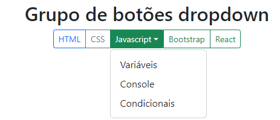

Espero que este tutorial seja útil para explorar e entender melhor os botões no Bootstrap! Se precisar de mais informações ou tiver alguma dúvida, sinta-se à vontade para perguntar.
<br>

