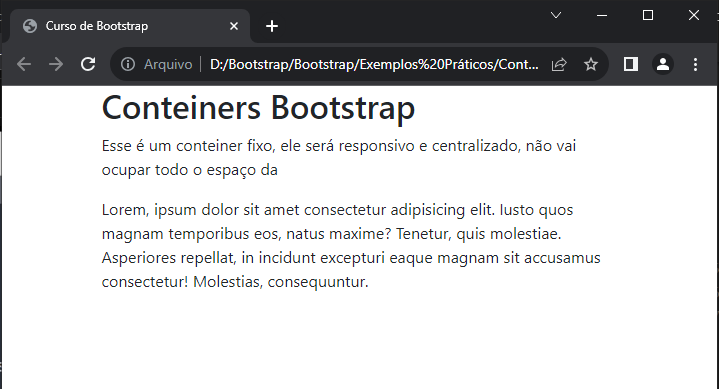

## Conteiners

[Visualizar Código HTML](Conteiners.html)

|Tópico|
|---|
|[Conteiner fixo](#1-conteiner-fixo)|
|[Conteiner Fluido](#2-conteiner-fluído)|

### 1. Conteiner Fixo


``` html
<div class="container">
    <h1>Conteiners Bootstrap</h1>
    <p>O contêiner fixo é responsivo, centralizado e não ocupará todo o width da página web.</p>
    <p>Lorem, ipsum dolor sit amet consectetur adipisicing elit. Iusto quos magnam temporibus eos, natus maxime? Tenetur, quis molestiae. Asperiores repellat, in incidunt excepturi eaque magnam sit accusamus consectetur! Molestias, consequuntur.</p>
</div>
```



### Tipos de Container fixo

|Classe|<576px|≥576px|≥768px|≥992px|≥1200px|≥1400px|
|----|----|----|----|----|---|---|
|.container|100%|540px|720px|960px|1140px|1320px|
|.container-sm|100%|540px|720px|960px|1140px|1320px|
|.container-md|100%|100%|720px|960px|	1140px|	1320px|
|.container-lg|	100%|	100%|	100%|	960px|	1140px|	1320px|
|.container-xl|	100%|	100%|	100%|	100%|	1140px|	1320px|
|.container-xxl|	100%|	100%|	100%|	100%|	100%|	1320px|
|.container-fluid|	100%|	100%|	100%|	100%|	100%|	100%|

### 2. Conteiner fluído

```html
<div class="container-fluid">
    <h1>Conteiners Bootstrap</h1>
    <p>Esse é um conteiner fluido, ele será responsivo e se ajustará a ocupar todo o width da página web</p>
    <p>Lorem, ipsum dolor sit amet consectetur adipisicing elit. Iusto quos magnam temporibus eos, natus maxime? Tenetur, quis molestiae. Asperiores repellat, in incidunt excepturi eaque magnam sit accusamus consectetur! Molestias, consequuntur.</p>
</div>
```


### Diferença entre Conteiner Fixo e Conteiner Fluído
```html
    <div class="container border">
        <h1>Conteiners Bootstrap</h1>
        <p>Esse é um conteiner fixo, ele será responsivo e centralizado, não vai ocupar todo o width da página web</p>
        <p>Lorem, ipsum dolor sit amet consectetur adipisicing elit. Iusto quos magnam temporibus eos, natus maxime? Tenetur, quis molestiae. Asperiores repellat, in incidunt excepturi eaque magnam sit accusamus consectetur! Molestias, consequuntur.</p>
    </div>
    <div class="container-fluid border">
        <h1>Conteiners Bootstrap</h1>
        <p>Esse é um conteiner fluido, ele será responsivo e se ajustará a ocupar todo o width da página web</p>
        <p>Lorem, ipsum dolor sit amet consectetur adipisicing elit. Iusto quos magnam temporibus eos, natus maxime? Tenetur, quis molestiae. Asperiores repellat, in incidunt excepturi eaque magnam sit accusamus consectetur! Molestias, consequuntur.</p>
    </div>
```


Algumas Classes do Bootstrap:

- pt-5: Adiciona 5 unidades de padding-top.
- bg-dark: Cor de fundo escura (preto).
- bg-primary: Cor de fundo primária-azul.
- text-white: Cor do texto branca.