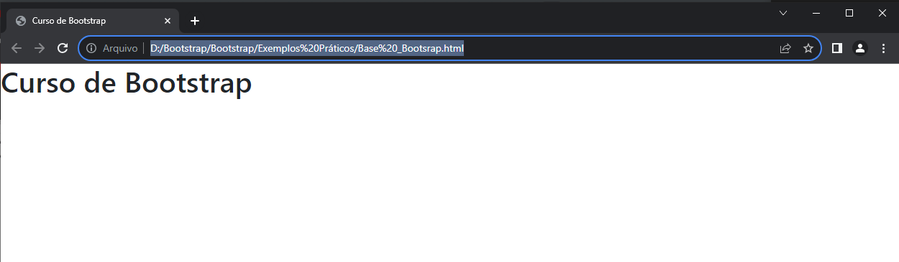
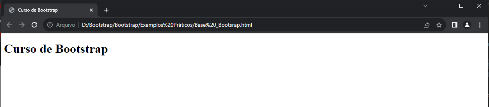

#   Exemplos Práticos

## Tabela de conteúdo
|Assunto|Resumo|
|-------|------|
|Conteiner <br> Conteiner-Fluid| [Saiba mais](Conteiners.md)|
## O que é o Boostrap?
<p>É um framework que nos auxilia a construir páginas responsiva com o conceito de mobile first</p>
Não é necessário baixar no computador, conseguimos utilizar por meio de links de Script do JavaScript e de folhas de estilo CSS


## Começo Rápido

Vamos começar colocando os links no nosso HTML, com o cdn não precisamos baixar Jquery nem importar nada, só inserir o link no nosso documento

- O de folha de estilo CSS:

    ``` html
    <link href="https://cdn.jsdelivr.net/npm/bootstrap@5.3.2/dist/css/bootstrap.min.css" rel="stylesheet" integrity="sha384-T3c6CoIi6uLrA9TneNEoa7RxnatzjcDSCmG1MXxSR1GAsXEV/Dwwykc2MPK8M2HN" crossorigin="anonymous">
    ```

- O do script de Javascript:
    ``` html
    <script src="https://cdn.jsdelivr.net/npm/bootstrap@5.3.2/dist/js/bootstrap.bundle.min.js" integrity="sha384-C6RzsynM9kWDrMNeT87bh95OGNyZPhcTNXj1NW7RuBCsyN/o0jlpcV8Qyq46cDfL" crossorigin="anonymous"></script>
    ```

    ## Base Boostrap
  ```html
        <!doctype html>
    <html lang="pt-br">
      <head>
        <meta charset="utf-8">
        <meta name="viewport" content="width=device-width, initial-scale=1">
        <title>Curso de Bootstrap</title>
        <link href="https://cdn.jsdelivr.net/npm/bootstrap@5.3.2/dist/css/bootstrap.min.css" rel="stylesheet" integrity="sha384-T3c6CoIi6uLrA9TneNEoa7RxnatzjcDSCmG1MXxSR1GAsXEV/Dwwykc2MPK8M2HN" crossorigin="anonymous">
      </head>
      <body>
        <h1>Curso de Bootstrap</h1>
        <script src="https://cdn.jsdelivr.net/npm/bootstrap@5.3.2/dist/js/bootstrap.bundle.min.js" integrity="sha384-C6RzsynM9kWDrMNeT87bh95OGNyZPhcTNXj1NW7RuBCsyN/o0jlpcV8Qyq46cDfL" crossorigin="anonymous"></script>
      </body>
    </html>
  ```
  <br>

  1. **Já temos nosso h1 na formatação padrão do Bootstrap**
  
  
  <br>

  2. **Sem a formatação padrão do Bootstrap**
  

